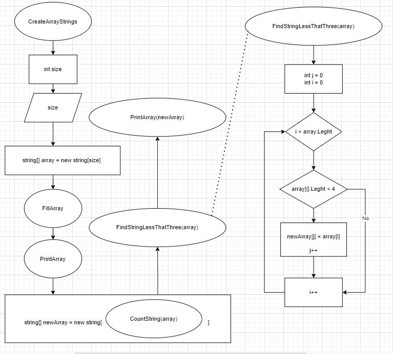

## Работа программы создания массива сторк менее 3х символов
В репозитории содержиться программа, а также схема алгоритма ее исполнения (схема укороченная, на ней представлен основной алгоритм и один из методов - метод заполнения нового массива )

## Что было непонятно в этом задании

* Мы до этого вроде не рисовали алгоритмы со вложенными методами (поэтому было непонятно как это нарисовать)
* Пока не разобрался в ошибке, 

        string str = Console.ReadLine();
        array[i] = str;

Буду признателен если напомните в чем тут проблема.

## В общем задание понравилось своей комплексностью!